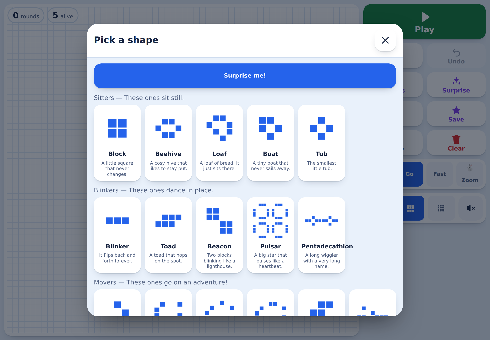

# Life — a game of little squares

Conway's Game of Life as a website, built to be played by touch on an iPad —
and specifically to be usable by a six-year-old on their own.



## Playing

- **Draw** by tapping squares, or drag to paint a line. Start on an empty
  square and you paint; start on a live one and you rub out.
- **Play** runs the game. Every round, a square with two or three live
  neighbours stays alive, an empty square with exactly three neighbours comes
  alive, and everything else dies.
- **Shapes** opens 18 famous patterns — still lifes, oscillators, spaceships
  and the Gosper glider gun — each shown as a picture of its actual cells.
- **Save** keeps whatever is on the grid in the browser, under a name. It
  turns up again under **Mine**, on this device, even after closing Safari.
- **Undo** takes back the last twelve things you did, including each drawing
  stroke.

The edges wrap around, so a glider that leaves the right-hand side comes back
on the left instead of disappearing.

Keyboard, on a desktop: `Space` play/pause, `→` step, `C` clear, `R` random,
`Z` undo.

## Running it

It is a static site with no build step and no dependencies:

```sh
python3 -m http.server 8080     # then open http://localhost:8080
```

Opening `index.html` straight from disk works too, except for the service
worker (browsers only allow those over http/https), so offline support needs
a server.

### Tests

```sh
npm test        # node --test, no dependencies
```

46 tests cover the rules engine, the pattern library (including that each
oscillator really has the period it claims and each spaceship really travels),
and the storage layer (quota, private browsing, and corrupt data).

### Icons

The PWA icons are generated, not checked in by hand:

```sh
npm run icons   # writes icons/*.png
```

## Deploying to GitHub Pages

Settings → Pages → Deploy from a branch → pick the branch and `/ (root)`.
Everything is relative, so it works from a project subpath. On the iPad, open
the page in Safari and use Share → **Add to Home Screen** for an app icon and
a fullscreen launch with no browser chrome.

## How it fits together

```
index.html            markup and the SVG icon sprite
css/styles.css        layout, light and dark themes, responsive rules
js/life.js            rules engine — pure, no DOM         ← unit tested
js/patterns.js        the built-in pattern library         ← unit tested
js/storage.js         localStorage layer and migration     ← unit tested
js/render.js          canvas drawing and hit-testing
js/input.js           touch, pointer and keyboard handling
js/sound.js           WebAudio blips (no audio files)
js/app.js             wiring, state machine, UI
sw.js                 cache-first service worker
scripts/make-icons.mjs  generates the PNG icons
test/                 node --test suites
```

`REQUIREMENTS.md` holds the agreed specification; each requirement has an id
(`S3`, `U7`, `D11`…) and the code refers to those ids where it implements
something non-obvious.

## Notes on the design

- **Storage** is namespaced and versioned (`conway-life:v1:*`) with a schema
  version in each document, so it can be migrated later. Patterns are stored
  trimmed to their bounding box, and the current grid is run-length encoded.
- **Timing** uses a fixed-timestep accumulator, so the speed setting means the
  same thing on a 60 Hz screen and a 120 Hz ProMotion iPad.
- **Failure** is quiet: no localStorage, a full quota, or corrupt data all
  leave a working app and a plain-language message.
